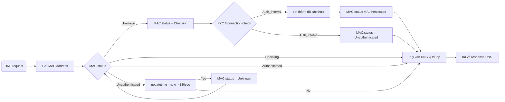

# Spec DNS trigger


## Xác thực bằng DNS trigger

Tiến hành xử lý authen bằng cách phát hiện request DNS.

Không hiển thị màn hình authen tới user, mà tiến hành truy vấn authen tới PXC, set đã xác thực hoặc để nguyên trạng thái chưa xác thực tùy theo response đó. 

Trường hợp đã kiểm tra được là chưa xác thực, dù có truy vấn từ cùng 1 MAC address thì trong khoảng 180 giây ko kiểm tra lại.

Trường hợp đã qua hơn 180 giây, có truy vấn từ MAC chưa xác thực thì sẽ thực hiện kiểm tra xác thực.

Chú ý：từ 1 thiết bị, sẽ phát sinh đồng thời nhiều request DNS nhưng ko chạy PXC /connection-check với từng cái. Set thành cơ chế không chạy đồng thời nhiều request của PXC.




## Phương pháp phát hiện request DNS


Tạo server DNS dùng để phát hiện request DNS

Spec như sau 

| Iten | Giải thích |
| ---- | ------------------------------ |
|Mục đích | Server DNS dùng để phát hiện request DNS |
|Port number |UDP 10053|
|Cách khởi động |Khởi động làm 1 Thread của PXF|
|Local Address| chỉ localhost, ko cho phép 0.0.0.0. Cấm truy cập từ bên ngoài|
|DNS vị trí top| Response của localhost:53 (DNSmasq)DNS sẽ truy vấn tới dnsmasq đang khởi động bằng PXF, get câu trả lời rồi response|

DNS communication của trước khi authen sẽ như sau

```
Client PC 8.8.8.8:53
↓
Thay đổi DEST thành localhost:10052 bằng iptables
↓
Server DNS dùng để phát hiện request DNS
↓
Truy vấn tới localhost:53
↓
DNSmasq sẽ response
```


## Content filtering

Trường hợp đã active content filtering thì xử lý sẽ như sau


```mermaid
graph LR

A(Request DNS) -->B[Get MAC address]
B --> C{MAC.status}
C --> |Unknown|P0[MAC.status = Checking]
C --> |Checking|R1[truy vấn DNS vị trí top]
C --> |Authenticated|S1{check category}
C --> |Unauthenticated|Q1[updatetime - now > 180sec]
Q1 -->|Yes|Q2[MAC.status = Unknown]
Q1 -->|No|R1
Q2 --> C
P0 --> PXC{PXC /connection-check}
PXC -->|Auth_info==1|P1[set thành đã xác thực]
P1 --> P2[MAC.status = Authenticated]
P2 --> R1
PXC -->|Auth_info!=1|P3[MAC.status = Unauthenticated]
P3 --> R1
R1 --> R2[trả về response DNS]
S1 --> |OK|R1
S1 --> |NG|S2[response DNS ERROR]
